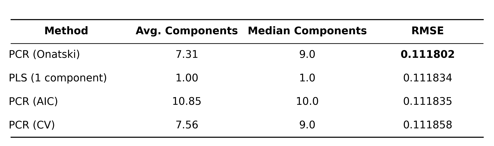
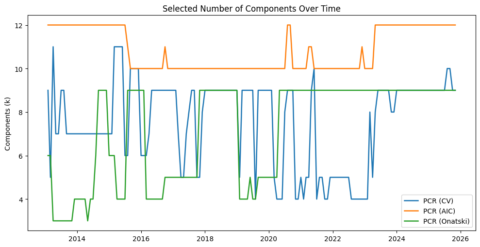
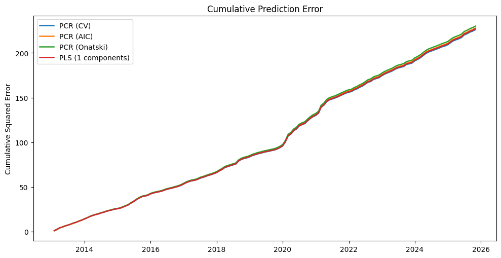
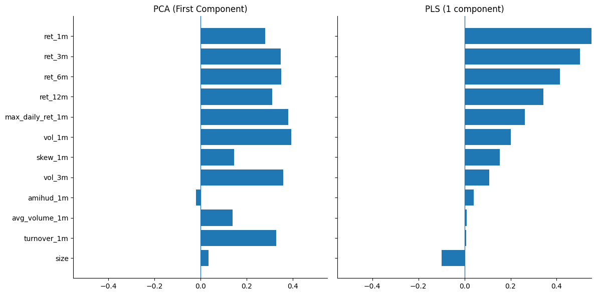

# PLS vs PCR for Return Prediction

## Overview
This project studies the use of dimensionality reduction techniques for cross-sectional stock return prediction.In particular, comparing Principal Component Regression (PCR) under multiple selection criteria (2-fold CV, AIC, and Onatski) with Partial Least Squares (PLS).

## Data
- Taiwan stock data (daily)  
**Source:** TEJ (Taiwan Economic Journal)  
**Time Period:** 2010-01-01 to 2025-12-31

## Predictors
The predictors are constructed from daily data and grouped into several economic categories:

- Reversal / Momentum
  - 1M return (short-term reversal)
  - 3M, 6M, 12M returns (momentum)
- Risk
  - 1M volatility
  - 3M volatility
- Liquidity
  - Turnover (1M)
  - Average volume (1M)
  - Amihud illiquidity
- Extreme / Lottery
  - Maximum daily return (1M)
  - Return skewness (1M)
- Firm characteristics
  - Size (log market capitalization)

All predictors are cross-sectionally standardized within each month.  
Target variable is the next-month return.

## $S_{train}$  $S_{test}$
**Expanding Window:**
- At each time ( t ):
  - Train on all data up to ( t )
  - Predict returns at ( t+1 )

- This ensures strictly out-of-sample evaluation and avoids look-ahead bias
- Allows the model to capture time-varying loadings, reflecting how factor exposures shift as new market data is incorporated

## Models
**1. Principal Component Regression (PCR)**  

PCR is implemented by:
1. Applying PCA to predictors
2. Regressing returns on the first ( k ) components

The number of components ( k ) is selected using:

- 2-Fold Cross-Validation
  - Splitting x_train by month rather than by row count, so that each fold preserves the monthly panel structure
  - Splitting train into two folds based on month (first half vs. second half) to maintain time-series integrity

- Akaike Information Criterion (AIC)  
  - While AIC is formally defined by degrees of freedom, $k$ (the number of components) acts as a close proxy in PCR
- Onatski criterion  
The implementation follows an iterative backward search from $K_{max}$ to 1
  - For each candidate $k$, perform a regression on eigenvalues from $k+1$ to $K_{max}$ to estimate the average noise decay
  - Identify the largest $k$ that satisfies the condition: $Current Drop \ge 2 \times Average Noise Decay$

**2. Partial Least Squares (PLS)**  
- One-component PLS model
- Directly extracts a component that maximizes covariance with returns

## Evaluation Metric

Out-of-sample performance is measured using:  

$RMSE_{test} = (\frac{1}{N} \sum (y_i - \hat{f}_{train}(x_{i}))^2)^{1/2}$

## Results

### Summary Table
- Increasing the number of components in PCR does not significantly improve predictive performance

- A single PLS component already captures most of the predictive signal

### Selected Number of Components ($k$) Over Time

### Cumulative Squared Prediction Error

### Top Loadings / Weights Comparison
- PCA (first component): captures dominant variation in predictors

- PLS (one component): captures variation most relevant for predicting returns

**Key Obervation:**  
1. The first principal component simultaneously captures both volatility (Risk) and short-to-medium-term Momentum.

2. PLS assigns heavy weight to ret_1m, validating the existence of strong short-term reversion in Taiwan stocks.